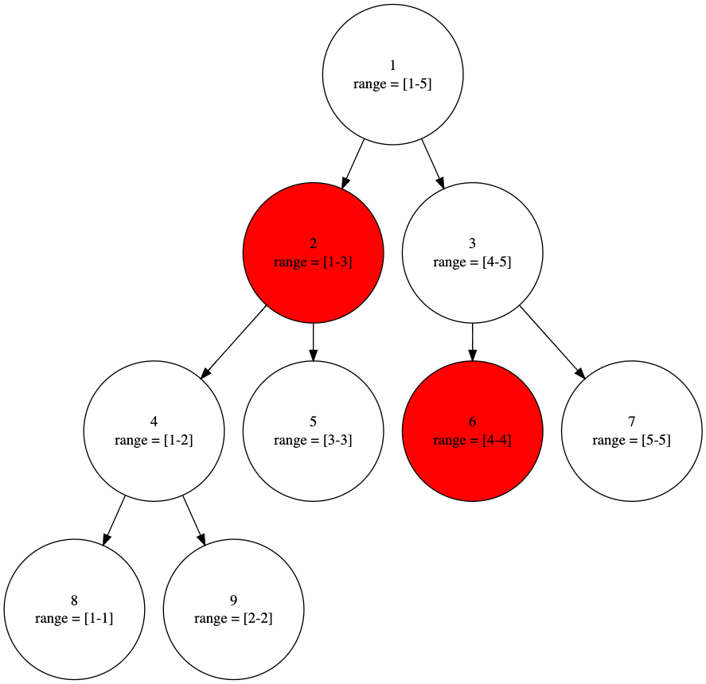
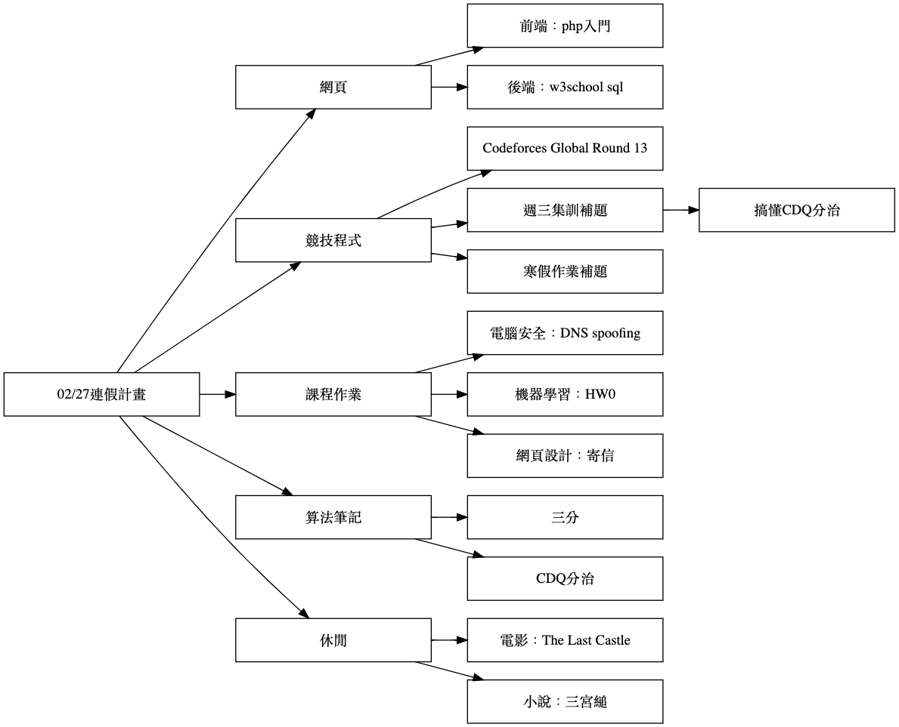
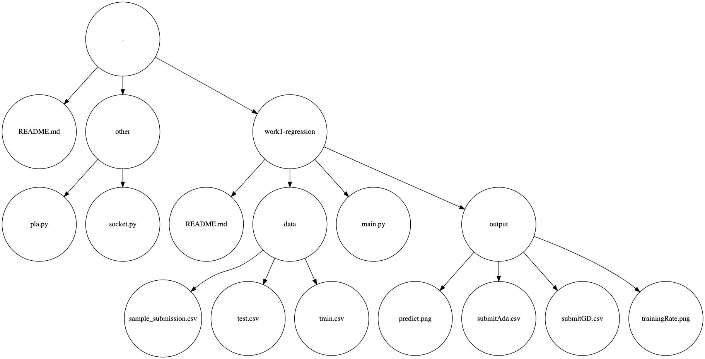
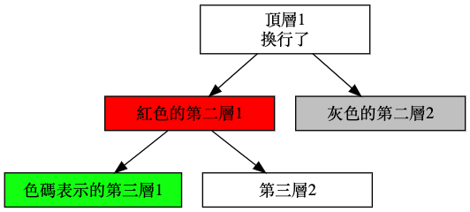

Visualization-Tool
---

- **發起時間**：2021/02/27
- **背景介紹**：不久前開始寫算法的筆記，難免需要畫資料結構的圖形，使用graphviz一行行打指令相當浪費時間，因此寫了一個自動生成graphviz code的程式節省精力。
- **功能**：
  - 視覺化資料結構：範例為算法筆記中線段樹的示意圖

    
  
  - 視覺化行程表：範例為連假規劃行程表

    

  - 視覺化檔案架構：範例為ML筆記的資料夾結構

    

- **使用方式**：
  - 工具目標在於快速的生成視覺圖，如上三個範例原始輸入應該都不超過兩百個字元，可以控制的範圍大致包含**圖形架構**、**圖形方向**、**節點形狀**、**節點顏色**等
  - 第一行指令為圖形方向與節點形狀的參數
    1. 圖形方向：有```TD```跟```LR```兩種參數，分別為由上到下繪製及由左到右繪製圖形
    2. 節點形狀：有許多種參數，具體可參考graphviz官網，個人常用的大概只有```circle```跟```box```
    3. 兩個參數由一個空白隔開，範例：```LR box```
  - 第二行以後為圖形架構
    1. 每往下一層需縮進四個空白（一個tab）
    2. 可在開頭```-```後接顏色決定節點顏色（可用常用顏色```red```、```green```或色碼如```#00ff00```表示）
    3. 若想要節點內不只一行，可透過```\n```換行
    4. 範例指令：
       ``` 
       頂層1 \n 換行了
           -red 紅色的第二層1
               -#12ff12 色碼表示的第三層1
               第三層2
           -gray 灰色的第二層2
       ```
    5. 視覺化：
       
       

- 工具輸出為graphviz的code，若電腦有graphviz的環境可直接生成png、pdf等格式的檔案，若沒有安裝，可用在線工具生成（如[網站](https://dreampuf.github.io/GraphvizOnline/)）
- 檔案架構可兼容linux的```tree```指令，將```tree```指令的輸出加上方向跟形狀的參數即可
